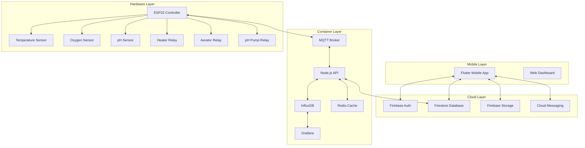

# 🏗️ Architecture Overview - Kolam Ikan IoT System

## 🎯 System Overview

Sistem monitoring kolam ikan terintegrasi yang menggabungkan:
- 📱 **Mobile App** (Flutter) - Interface pengguna
- 🔥 **Firebase Cloud** - Data storage & authentication  
- 🐳 **Docker Containers** - Local processing & monitoring
- 🔧 **ESP32 Hardware** - Sensor & actuator control

---

## 🏛️ High-Level Architecture



---

## 📱 Mobile Application Architecture

### Flutter App Structure
```
lib/
├── 🏠 main.dart                    # App entry point
├── 📁 config/
│   ├── firebase_options.dart       # Firebase configuration
│   └── app_config.dart            # App constants
├── 📁 models/
│   ├── sensor_data.dart           # Sensor data model
│   ├── pond_model.dart            # Pond information
│   ├── user_model.dart            # User profile
│   └── device_model.dart          # ESP32 device info
├── 📁 services/
│   ├── firebase_service.dart      # Firebase operations
│   ├── mqtt_service.dart          # MQTT communication
│   └── notification_service.dart  # Push notifications
├── 📁 providers/
│   ├── dashboard_provider.dart    # Dashboard state
│   ├── auth_provider.dart         # Authentication
│   └── settings_provider.dart     # App settings
├── 📁 screens/
│   ├── dashboard_screen.dart      # Main monitoring
│   ├── control_panel_screen.dart  # Device control
│   ├── analytics_screen.dart      # Data analysis
│   └── settings_screen.dart       # Configuration
└── 📁 widgets/
    ├── sensor_card.dart           # Sensor display
    ├── chart_widget.dart          # Data visualization
    └── control_button.dart        # Device controls
```

### State Management Pattern
```dart
// Provider Pattern Implementation
class DashboardProvider extends ChangeNotifier {
  // Real-time sensor data
  Stream<SensorData> sensorDataStream;
  
  // Device control state
  Map<String, bool> deviceStates;
  
  // Update methods
  void updateDeviceState(String device, bool state);
  void setSensorData(SensorData data);
}
```

---

## 🔥 Firebase Cloud Architecture

### Firestore Database Structure
```
firestore/
├── 👥 users/{userId}
│   ├── email: string
│   ├── role: "admin" | "user"
│   ├── createdAt: timestamp
│   └── lastLogin: timestamp
│
├── 🏊 ponds/{pondId}
│   ├── name: string
│   ├── location: string
│   ├── ownerId: string
│   ├── devices: array
│   └── settings: object
│
├── 📊 sensorData/{dataId}
│   ├── pondId: string
│   ├── deviceId: string
│   ├── temperature: number
│   ├── oxygen: number
│   ├── phLevel: number
│   └── timestamp: timestamp
│
├── 🎛️ controlSettings/{settingId}
│   ├── pondId: string
│   ├── targetTemperature: number
│   ├── targetOxygen: number
│   ├── targetPh: number
│   ├── autoMode: boolean
│   └── lastUpdated: timestamp
│
└── 🚨 alerts/{alertId}
    ├── pondId: string
    ├── type: string
    ├── message: string
    ├── severity: "low" | "medium" | "high"
    ├── resolved: boolean
    └── timestamp: timestamp
```

### Firebase Security Rules
```javascript
rules_version = '2';
service cloud.firestore {
  match /databases/{database}/documents {
    // Users can only access their own data
    match /users/{userId} {
      allow read, write: if request.auth != null && request.auth.uid == userId;
    }
    
    // Pond access based on ownership
    match /ponds/{pondId} {
      allow read, write: if request.auth != null && 
        (resource.data.ownerId == request.auth.uid || 
         get(/databases/$(database)/documents/users/$(request.auth.uid)).data.role == 'admin');
    }
    
    // Sensor data read access for pond owners
    match /sensorData/{dataId} {
      allow read: if request.auth != null;
      allow write: if request.auth != null && 
        get(/databases/$(database)/documents/ponds/$(resource.data.pondId)).data.ownerId == request.auth.uid;
    }
  }
}
```

---

## 🐳 Container Architecture

### Docker Compose Services
```yaml
version: '3.8'
services:
  # MQTT Message Broker
  mosquitto:
    image: eclipse-mosquitto:2.0
    ports: ["1883:1883", "9001:9001"]
    volumes: ["./mosquitto.conf:/mosquitto/config/mosquitto.conf"]
    
  # Time Series Database
  influxdb:
    image: influxdb:2.7
    ports: ["8086:8086"]
    environment:
      INFLUXDB_DB: "kolam_iot"
      INFLUXDB_ADMIN_USER: "admin"
      INFLUXDB_ADMIN_PASSWORD: "admin123"
    volumes: ["influxdb_data:/var/lib/influxdb2"]
    
  # API Server
  api_server:
    build: "./backend"
    ports: ["3000:3000"]
    environment:
      MQTT_HOST: "mosquitto"
      INFLUXDB_URL: "http://influxdb:8086"
      REDIS_URL: "redis://redis:6379"
    depends_on: ["mosquitto", "influxdb", "redis"]
    
  # Caching Layer
  redis:
    image: redis:7-alpine
    ports: ["6379:6379"]
    volumes: ["redis_data:/data"]
    
  # Monitoring Dashboard
  grafana:
    image: grafana/grafana:10.0.0
    ports: ["3001:3000"]
    environment:
      GF_SECURITY_ADMIN_PASSWORD: "admin123"
    volumes: ["grafana_data:/var/lib/grafana"]
```

### API Server Endpoints
```javascript
// REST API Structure
const express = require('express');
const app = express();

// Health check
app.get('/health', (req, res) => {
  res.json({ status: 'healthy', timestamp: new Date() });
});

// Sensor data endpoints
app.get('/api/sensor-data/:pondId', getSensorData);
app.post('/api/sensor-data', saveSensorData);

// Device control endpoints
app.post('/api/control/:deviceId', sendControlCommand);
app.get('/api/device-status/:deviceId', getDeviceStatus);

// Analytics endpoints
app.get('/api/analytics/:pondId', getAnalytics);
app.get('/api/export/:pondId', exportData);

// WebSocket for real-time updates
const io = require('socket.io')(server);
io.on('connection', (socket) => {
  socket.on('subscribe', (pondId) => {
    socket.join(`pond_${pondId}`);
  });
});
```

---

## 🔧 Hardware Architecture

### ESP32 System Design
```cpp
// Main system components
class KolamIoTSystem {
private:
    // Hardware components
    OneWire oneWire;
    DallasTemperature tempSensor;
    WiFiClient wifiClient;
    PubSubClient mqttClient;
    
    // Sensor pins
    const int TEMP_PIN = 4;
    const int DO_PIN = 32;
    const int PH_PIN = 33;
    
    // Actuator pins
    const int HEATER_PIN = 25;
    const int AERATOR_PIN = 26;
    const int PH_PUMP_PIN = 27;
    
public:
    void setup();
    void loop();
    void readSensors();
    void publishData();
    void handleCommands();
    void controlDevices();
};
```

### MQTT Message Protocol
```json
// Sensor Data Topic: kolam/sensor/data
{
  "deviceId": "ESP32_001",
  "pondId": "pond_001",
  "timestamp": "2025-01-03T10:30:00Z",
  "sensors": {
    "temperature": 25.5,
    "oxygen": 6.2,
    "phLevel": 7.1,
    "waterLevel": 85.3
  },
  "status": {
    "wifiSignal": -45,
    "batteryLevel": 95,
    "uptime": 3600
  }
}

// Control Command Topic: kolam/control/command
{
  "deviceId": "ESP32_001",
  "command": "setHeater",
  "value": true,
  "timestamp": "2025-01-03T10:30:00Z",
  "source": "mobile_app"
}

// Device Status Topic: kolam/device/status
{
  "deviceId": "ESP32_001",
  "online": true,
  "lastSeen": "2025-01-03T10:30:00Z",
  "firmwareVersion": "1.0.0",
  "devices": {
    "heater": true,
    "aerator": false,
    "phPump": false
  }
}
```

---

## 🔄 Data Flow Architecture

### Real-time Data Pipeline
```
ESP32 Sensors → MQTT Broker → API Server → InfluxDB
                    ↓
                Firebase ← API Server
                    ↓
                Flutter App ← WebSocket/Stream
```

### Control Command Flow
```
Flutter App → Firebase → API Server → MQTT Broker → ESP32
```

### Monitoring & Analytics Flow
```
InfluxDB → Grafana Dashboard
     ↓
Firebase → Flutter Analytics
```

---

## 🛡️ Security Architecture

### Authentication & Authorization
```
User Login → Firebase Auth → JWT Token → API Access
```

### Data Security Layers
1. **Transport Layer**: TLS/SSL encryption
2. **Application Layer**: Firebase security rules
3. **Database Layer**: Role-based access control
4. **Device Layer**: MQTT authentication

### Network Security
```
Internet → Firewall → Load Balancer → API Gateway → Services
                                          ↓
Local Network → MQTT Broker ← ESP32 Devices
```

---

## ⚡ Performance Architecture

### Scalability Design
- **Horizontal Scaling**: Multiple Docker containers
- **Database Sharding**: Pond-based data partitioning
- **Caching Strategy**: Redis for frequently accessed data
- **CDN**: Firebase hosting for static assets

### Performance Optimization
```
Client Side:
├── Image optimization
├── Lazy loading
├── State caching
└── Offline capabilities

Server Side:
├── Database indexing
├── Connection pooling
├── Response caching
├── Query optimization

Hardware Side:
├── Sleep modes
├── Batch data transmission
├── Local buffering
└── Efficient protocols
```

---

## 🔮 Future Architecture Considerations

### Planned Enhancements
1. **AI/ML Integration**: Predictive analytics for fish behavior
2. **Edge Computing**: Local processing on ESP32
3. **Blockchain**: Data integrity and traceability
4. **IoT Gateway**: Support for multiple device types
5. **Voice Control**: Integration with Google Assistant/Alexa

### Scalability Roadmap
```
Phase 1: Single pond monitoring (Current)
Phase 2: Multiple ponds per user
Phase 3: Commercial farm management
Phase 4: Regional monitoring network
Phase 5: AI-powered automation
```

---

**Architecture Review**: Monthly technical review meetings
**Version Control**: Git with feature branching strategy
**Documentation**: Living architecture documents updated with each release